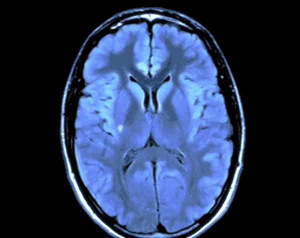
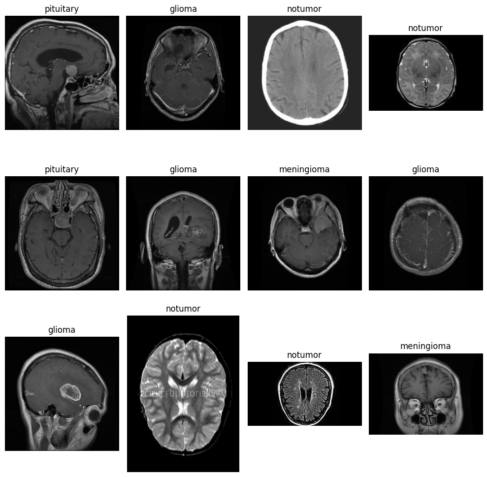
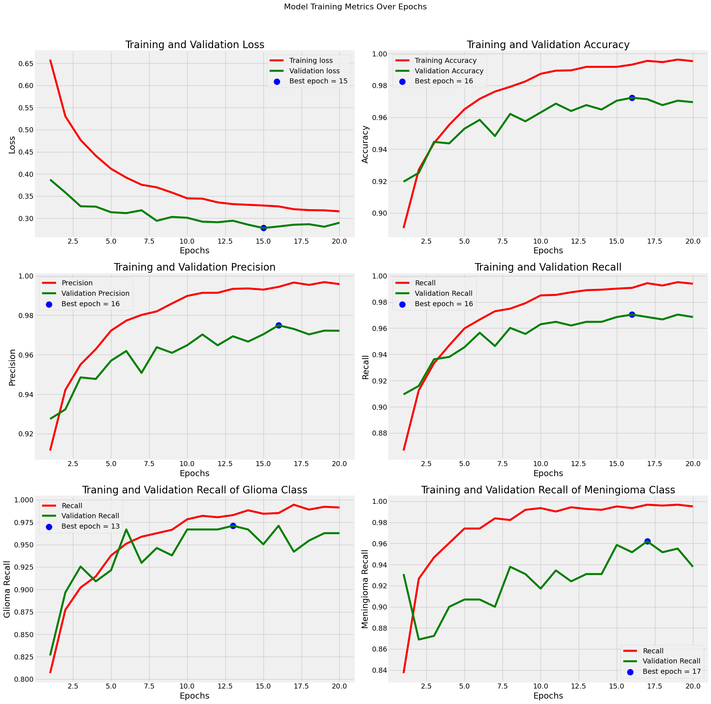
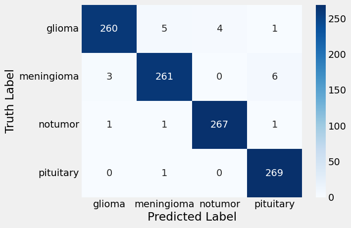
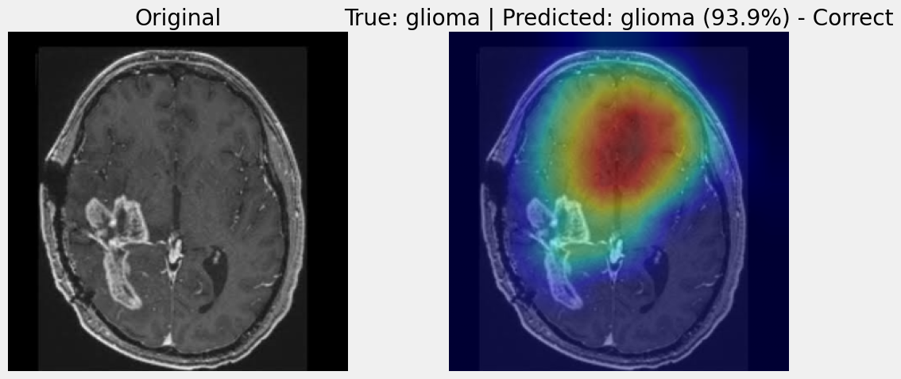
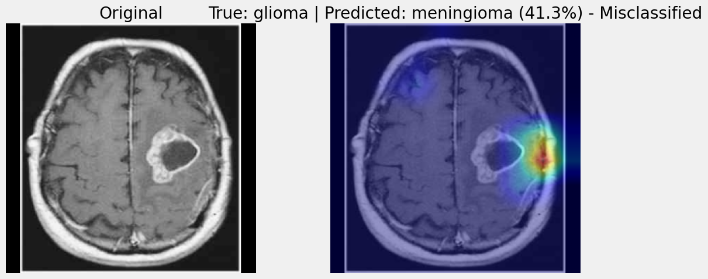
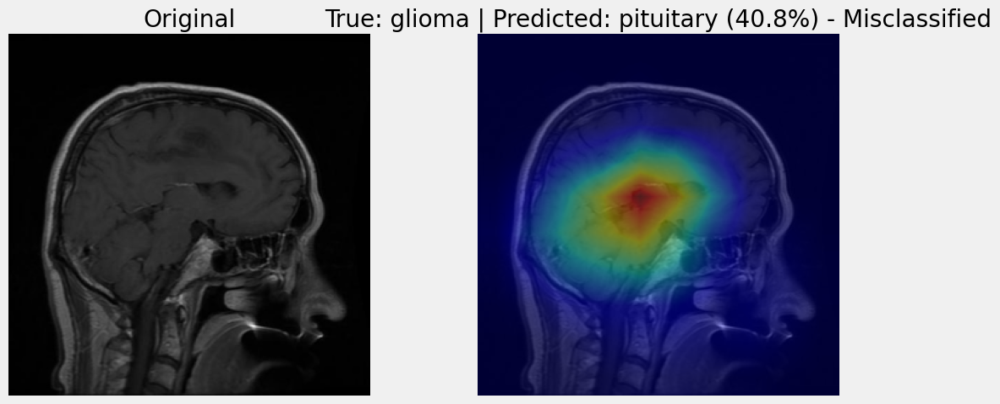

<div align="center">



# Brain Tumor MRI Classification using Xception with GradCAM

**Deep learning model to classify brain MRI scans into 4 clinical categories, with Grad-CAM explainability**

[](https://www.kaggle.com/aakcodebreaker/brain-tumor-classification)
[](https://python.org)
[](https://tensorflow.org)
[](https://keras.io)
[](#results)

</div>

---

## Overview

Brain tumors can be life-threatening, and early, accurate classification is critical for treatment planning. This project builds a deep learning classifier that identifies tumor type directly from MRI scans — automating what would otherwise require expert radiologist interpretation. On top of the classifier, it adds **Grad-CAM explainability** so predictions aren't a black box — you can see exactly which regions of a scan the model is basing its decision on.

The model classifies scans into four categories:

| Class | Description |
|-------|-------------|
| **Glioma** | Tumors arising from glial cells; often aggressive |
| **Meningioma** | Originates in the meninges; typically slower growing |
| **Pituitary** | Affects the pituitary gland at the brain's base |
| **No Tumor** | Healthy brain scan |

---

## Dataset

**7,200 brain MRI images** sourced from Kaggle, recombined and re-split for cleaner stratification:

```
Training set   → 4,592 images (stratified)
Validation set → 1,008 images (stratified)
Test set       → 1,600 images (held-out)
```

All images resized to **299×299** to match Xception's expected input.



---

## Approach

### Architecture: Xception + Custom Head

The backbone is **Xception** (pretrained on ImageNet), chosen for its depthwise separable convolutions — highly parameter-efficient and strong on texture-rich inputs like MRI scans.

A custom classification head is attached on top:

```
Xception (frozen) → GAP + GMP → Concatenate(4096)
→ BN → Dense(256, ReLU) → BN → Dropout(0.36)
→ Dense(128, ReLU) → BN → Dropout(0.24)
→ Dense(32, ReLU) → Dropout(0.1)
→ Dense(4, Softmax)
```

Total params: **21.9M** | Trainable (Phase 1): **1.09M**

### Training Strategy

**Phase 1 — Feature Extraction** (10 epochs, base frozen)
- Optimizer: AdamW (`lr=3e-4`, `weight_decay=1e-4`)
- Loss: Categorical Crossentropy with label smoothing (0.1)
- Callbacks: EarlyStopping (monitors `val_loss`) + ModelCheckpoint

**Phase 2 — Fine-tuning** (up to 30 epochs, last 40 layers unfrozen)
- Optimizer: AdamW (`lr=4e-5`, `weight_decay=1e-4`)
- Label smoothing reduced to 0.05
- Class weights applied to lean harder into the classes that need it (meningioma weighted highest at 2.4, no-tumor lowest at 0.8)
- `ReduceLROnPlateau` with factor 0.2
- EarlyStopping switches to monitoring `TumorRecall` (max) instead of loss



### Custom Metric: TumorRecall

A domain-aware metric tracking **average recall across glioma and meningioma** — the two classes where false negatives carry the highest clinical cost. EarlyStopping in Phase 2 monitors this metric rather than generic accuracy.

---

## Results

`Train Loss` : **0.2627** \
`Train Accuracy` : **98.11%** \
`Combined Recall of 2 most difficult classes` : **97.96%**

`Validation Loss` : **0.3164** \
`Validation Accuracy` : **95.93%** \
`Combined Recall of 2 most difficult classes` : **94.30%**

`Test Loss` : **0.2923** \
`Test Accuracy` : **96.38%** \
`Combined Recall of 2 most difficult classes` : **94.88%**

### Confusion Matrix


### Classification Report

| Class | Precision | Recall | F1-Score |
|-------|-----------|--------|----------|
| Glioma | 0.95 | 0.95 | 0.95 |
| Meningioma | 0.95 | 0.94 | 0.94 |
| No Tumor | 0.99 | 0.97 | 0.98 |
| Pituitary | 0.97 | 0.99 | 0.98 |
| **Macro Avg** | **0.96** | **0.96** | **0.96** |

---

## Explainability: Grad-CAM

To check that the model is actually keying off tumor tissue — not scan artifacts, borders, or other shortcuts — every prediction can be explained with **Grad-CAM** (Gradient-weighted Class Activation Mapping), overlaid as a heatmap on the original scan.

- **Target layer:** `block14_sepconv2_act`, Xception's last convolutional block.
- Since Xception is nested as a single layer inside the full model, the classifier is rebuilt as two connected sub-models (`feature_model` + `classifier_head`) that expose the target layer's activations while exactly reproducing the trained model's outputs — verified with a numerical sanity check against the original model.
- For each class, the notebook shows one correctly classified example alongside one misclassified example for each other class (where present in the test set), so you can compare where the model looks when it gets a prediction right versus where it looks when it gets fooled.

<div align="center">

### Glioma


### Meningioma


### Pituitary


</div>

---

## Stack

`TensorFlow 2.21` · `Keras 3.14` · `Xception` · `OpenCV` · `scikit-learn` · `Matplotlib` · `Seaborn`

---

## Run It

```bash
# Open on Kaggle (GPU recommended)
# Dataset: Brain Tumor MRI Dataset (Kaggle)
```

The notebook is fully self-contained — data loading, preprocessing, model build, training, evaluation, and Grad-CAM explainability are all in sequence.

---

<div align="center">

Made with curiosity · [Kaggle Profile](https://www.kaggle.com/aakcodebreaker) · [GitHub](https://github.com/Ayaan-Ali-Khan)

</div>
